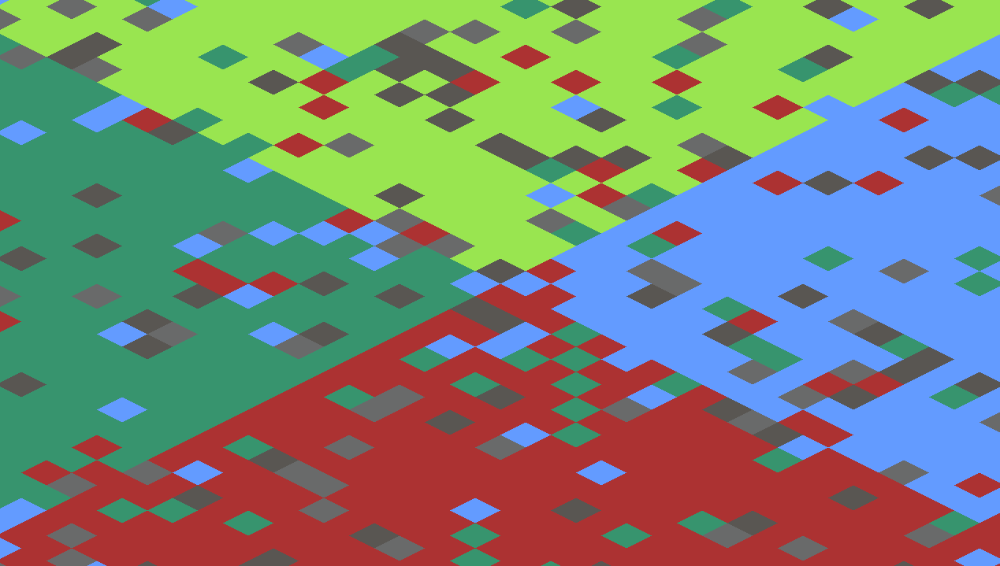
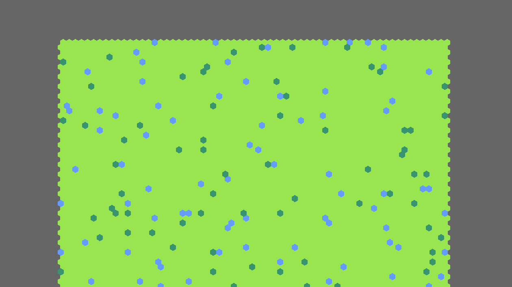

# `bevy_ecs_tilemap`

[](https://crates.io/crates/bevy_ecs_tilemap)
[](https://docs.rs/bevy_ecs_tilemap/)
[](https://github.com/StarArawn/bevy_ecs_tilemap/blob/main/LICENSE)
[](https://crates.io/crates/bevy_ecs_tilemap)

A tilemap rendering plugin for [`bevy`](https://bevyengine.org/). It is more ECS friendly as it makes tiles entities.

## Features
 - A tile per entity.
 - Fast rendering using a chunked approach.
 - Layers and sparse tile maps.
 - GPU powered animations.
 - Isometric and Hexagonal tile maps.
 - Initial support for Tiled file exports.

## Upcoming Features
 - [x] Support for isometric and hexagon rendering.
 - [x] Built in animation support  – see [`animation` example](examples/animation.rs).
 - [x] Texture array support.
 - [x] Layers and add/remove tiles.


## Screenshots



### How Does This Work?
Quite simple there is a tile per entity. Behind the scenes the tiles are split into chunks that each have their own mesh which is sent to the GPU in an optimal way.

### Why Use This Instead of X?
Because each tile is an entity of its own editing tiles is super easy and convenient. This allows you to tag entities for updating and makes stuff like animation easier. Want to have a mining simulation where damage is applied to tiles? That’s easy with this plugin:

```rust
struct Damage {
    amount: u32,
}

fn update_damage(
    mut query: Query<(&mut Tile, &Damage), Changed<Damage>>,
) {
    for (mut tile, damage) in query.iter_mut() {
        tile.texture_index = TILE_DAMAGE_OFFSET + damage.amount;
    }
}
```

## Examples
 - [`accessing_tiles`](examples/accessing_tiles.rs) – An example showing how one can access tiles from the map object by using tile map coordinates.
 - [`animation`](examples/animation.rs) – Basic CPU animation example.
 - [`atlas_spacing`](examples/atlas_spacing.rs) – Usage of atlas textures with multiple rows and spacing.
 - [`bench`](examples/bench.rs) - A stress test of the map rendering system. Takes a while to load.
 - [`dynamic_map`](examples/dynamic_map.rs) - A random map that is only partial filled with tiles that changes every so often.
 - [`game_of_life`](examples/game_of_life.rs) - A game of life simulator.
 - [`hex_column`](examples/hex_column.rs) - A map that is meshed using “pointy” hexagons.
 - [`hex_row`](examples/hex_row.rs) - A map that is meshed using flat hexagons.
 - [`iso_diamond`](examples/iso_diamond.rs) - An isometric meshed map using diamond ordering.
 - [`iso_staggered`](examples/iso_staggered.rs) - An isometric meshed map using staggered ordering.
 - [`layers`](examples/layers.rs) - An example of how you can use multiple map entities/components for “layers”.
 - [`ldtk`](examples/ldtk/ldtk.rs) - An example of loading and rendering of a LDTK map which requires the `ldtk` feature. Use: `cargo run --example ldtk --features ldtk`
 - [`map`](examples/map.rs) - The simplest example of how to create a tile map.
 - [`random_map`](examples/random_map.rs) - A bench of editing all of the tiles every 100 ms.
 - [`remove_tiles`](examples/remove_tiles.rs) - An example showing how you can remove tiles by using map_query
 - [`sparse_tiles`](examples/sparse_tiles.rs) - An example showing how to generate a map where not all of the tiles exist for a given square in the tile map.
 - [`tiled`](examples/tiled/tiled.rs) - An example of loading and rendering of a tiled map editor map which requires the `tiled_map` feature. Use: `cargo run --example tiled`
 - [`tiled_rotate`](examples/tiled/tiled_rotate.rs) - An example of loading and rendering of a tiled map editor map with flipping and rotation.requires the `tiled_map` feature. Use: `cargo run --example tiled_rotate`
 - [`visibility`](examples/visibility.rs) - An example showcasing visibility of tiles and chunks.

### Running Examples

```
cargo run --release --example map
```

### Running examples on web!
```
cargo build --target wasm32-unknown-unknown --example animation --release --features atlas
wasm-server-runner .\target\wasm32-unknown-unknown\release\examples\animation.wasm
```

## Known Issues
 - Tile flipping by x, y and d, should work for all maps, however "d" (anti diagonal) flipping is not implemented for non-square maps.
 - Besides the above no known issues.

## Asset credits
 - Field of green by [GuttyKreum](https://guttykreum.itch.io/).
